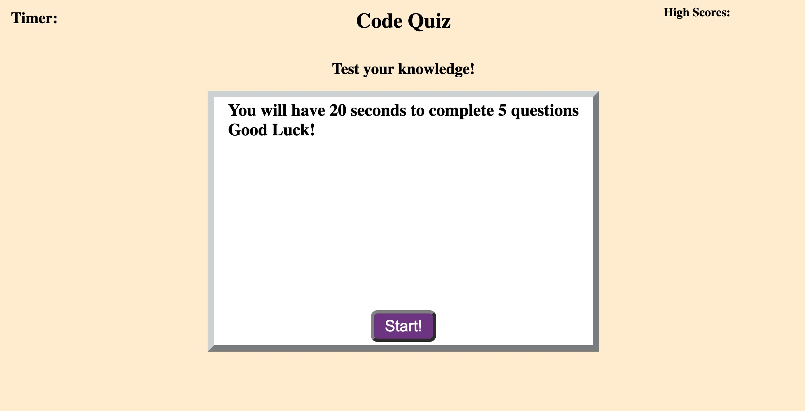
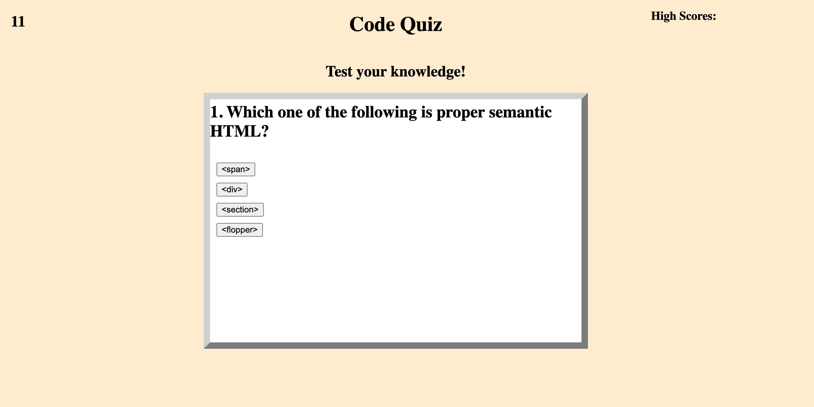

# Code Quiz

## Site Picture

Deployed Link
https://wseban.github.io/Code-Quiz/

## Usage
Upon coming to the site the user is presented with a start button and a place where their timer(upper left) and high scores(upper right) will be displayed...



When the user clicks the start button they will be presented with a multiple choice question and the timer will start.  If they get a question wrong, 5 seconds will be deducted from the timer...
 


## Technologies Used
- JavaScript - Allows developer to make static webpages dynamic and interactive.  For this exercise it was used to alter the original webpage to change the questions, change the answers, add a dynamic timer/countdown(that also ends the game), as well as, allow saving of scores.
- HTML - Gives a basic static structure to the webpage.
- CSS - Allows the developer to make the webpage a little more appealing.
- Git - Git is what I used to work on my personal computer and pushing my work to GitHub.
- GitHub - A cloud based repository that holds my saved code reserved for resetting my personal computer deployment.

## Description

The purpose of this project was to utilize our skills with HTML, CSS and, primarily, JavaScript to create a code quiz.  This code quiz was to be as dynamic as possible using the allocated tools and languages.  Upon the start of the quiz, the desired outcome was for the questions to be presented, one by one, if the user got a question correct, the score was to be incremented and tracked throughout the remaining questions, but if they got a question wrong, the time alloted was decreased and presented in the timer.

## Installation

NA

## Lessons Learned
The most effective lessons learned for me were...
1. Using DOM traversal to link events to the correct answers; thereby incremented the score correctly.  
2. Getting the timer set accurately presented in order to end the game when it hit 0.
3. During the creation of this page the scores were being incremented incorrectly until some of the button event-listeners were removed, before reapplying to another function. 

## Code Snippets
JavaScript
```javaScript
function questionTwo(event){
    if(event.target.textContent === answer1){
      score++;
    }
    else{
        timeCount = timeCount - 5;
    }

function qTimer(){
    timeRemaining = setInterval(function(){
        timeCount--;
        console.log(timeCount)
        timerTracker.textContent = Math.floor(timeCount);
        if (timeCount <= 0){
            timeCount = 0;
            clearInterval(timeRemaining);
            endGame();
        }
    }, 1000)
}

startQuizBtn.removeEventListener("click", endQuiz);
    startQuizBtn.addEventListener("click", begin);
    startQuizBtn.textContent = "Again?"

```
## Credits

NA

## License
Please refer to the LICENSE in the Repo.